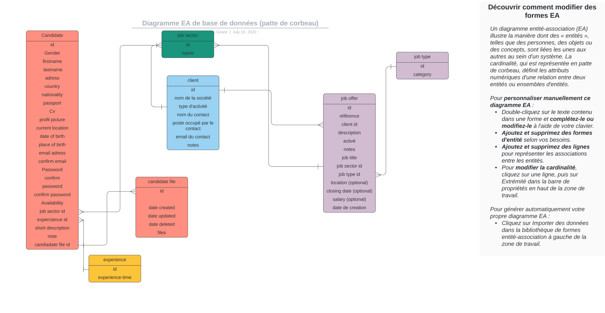

# LUXURY SERVICES



## faire une migration
```shell
     php bin/console make:migration
     php bin/console doctrine:migrations:migrate
```


## wizard creation entity
```shell
php bin/console make:entity
```
## afficher les routes definies
```shell
php bin/console debug:route
```
## pour la compatiblité de route sous win avec laragon
```shell
 composer require symfony/apache-pack 
```

## symfony error convert objet to string
```shell
        public  function __toString()
    {
        return $this->getName();
    }
```

## pour construit un crud
```shell
    php bin/console make:crud
```

## upload une image dans une BDD
```shell
#'code dans le typeform' 
 use Symfony\Component\Form\Extension\Core\Type\FileType;

#'code dans le builder'
    ->add('profilPicture', FileType::class, [
                'mapped' => false
            ])
    
# 'code dans le controller'
    use Symfony\Component\String\Slugger\SluggerInterface;

    /**
     * @Route("/new", name="candidate_new", methods={"GET","POST"})
     */
    public function new(Request $request, SluggerInterface $slugger): Response '->!!ne pas oublier SluggerInterface $slugger'
    {
        $candidate = new Candidate();
        $form = $this->createForm(CandidateType::class, $candidate);
        $form->handleRequest($request);

        if ($form->isSubmitted() && $form->isValid()) {
            $entityManager = $this->getDoctrine()->getManager();


            /** @var UploadedFile $file */
            $file = $form->get('profilPicture')->getData();

            if ($file){
                $originalFilename = pathinfo($file->getClientOriginalName(), PATHINFO_FILENAME);
               
                $safeFilename = $slugger->slug($originalFilename);
                $newFilename = $safeFilename.'-'.uniqid().'.'.$file->guessExtension();

                
                try {
                    $file->move(
                        $this->getParameter('pictures_directory'),
                        $newFilename
                    );
                } catch (FileException $e) {
                    $newFilename = 'error file upload';
                }

                $candidate->setProfilPicture($newFilename);
            }

            $entityManager->persist($candidate);
            $entityManager->flush();

            return $this->redirectToRoute('candidate_index');
        }

        return $this->render('candidate/new.html.twig', [
            'candidate' => $candidate,
            'form' => $form->createView(),
        ]);
    }

# 'mettre le dossier upload dans public ou autre, définir la chemin dans config/services.yaml
# expemple'
    parameters:
    pictures_directory: '%kernel.project_dir%/public/uploads/'


 ```
## liens vers la doc de symfony
    https://symfony.com/doc/current/controller/upload_file.html#creating-an-uploader-service